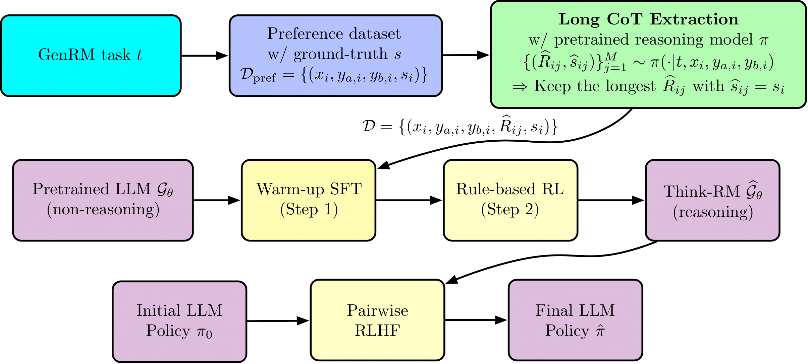

# Think-RM: Enabling Long-Horizon Reasoning in Generative Reward Models

<p align="center">
  📝 <a href="https://www.arxiv.org/abs/2505.16265">Paper</a> &middot;
  🚀 <a href="https://think-rm.github.io/">Project Page</a>
</p>

<div align="center">
  
  <p><em> Overview of the Think-RM training framework</em></p>
</div>

<!--<p align="center">
  
  
  
</p>-->

## Overview

This repository implements **Think-RM**, a training framework that enables long-horizon reasoning in GenRMs by modeling an internal thinking process. In addition, we implement **pairwise RLHF** pipeline that directly optimizes policies using pairwise preference. It includes the following components:

- [EvalGenRM](./EvalGenRM): Generative reward model evaluation.
- [OpenRLHF](./OpenRLHF): Warm-up SFT training.
- [VERL](./VERL): Rule-based RL.
- [PairwiseRLHF](./PairwiseRLHF): Pairwise RLHF for GenRMs.

  ```bash
  Think-RM/
  ├── EvalGenRM/            # GenRM evaluation
  ├── OpenRLHF/             # SFT warm-up
  ├── VERL/                 # Rule-based RL
  └── PairwiseRLHF/         # Pairwise RLHF for GenRMs
  ```

---

## 🤗 Pretrained Models

🧠 [Binary Think-RM](https://huggingface.co/ilgee/Binary-Think-RM-8B)
<!--
(https://huggingface.co/ilgee/hs2-naive-binary-max-ep5-lr1e-5-grpo-ep1-lr2e-6-kl1e-4-rollout512-v0)
-->

🧠 [Multiclass Think-RM](https://huggingface.co/ilgee/Multiclass-Think-RM-8B)
<!--
(https://huggingface.co/ilgee/hs2-naive-multiclass-min-ep5-lr5e-6-grpo-ep2-lr2e-6-kl1e-4-rollout512-half-v0)
-->

🧠 [Binary CoT-GenRM (Ground Truth)](https://huggingface.co/ilgee/Binary-CoT-GenRM-groundtruth-8B)

<!--(https://huggingface.co/ilgee/groundtruth-multiclass-ep5-lr1e-5)-->

🧠 [Multiclass CoT-GenRM (Ground Truth)](https://huggingface.co/ilgee/Multiclass-CoT-GenRM-groundtruth-8B)

<!--(https://huggingface.co/ilgee/groundtruth-multiclass-ep5-lr1e-5)-->

🧠 [Binary CoT-GenRM (Model-Generated)](https://huggingface.co/ilgee/Binary-CoT-GenRM-8B)

<!--(https://huggingface.co/ilgee/generated-multiclass-ep10-lr5e-6)-->

🧠 [Multiclass CoT-GenRM (Model-Generated)](https://huggingface.co/ilgee/Multiclass-CoT-GenRM-8B)

<!--(https://huggingface.co/ilgee/generated-multiclass-ep10-lr5e-6)-->

---

## 🤗 Long CoT Data

📄 [Binary Long CoT](https://huggingface.co/datasets/ilgee/hs2-naive-reasoning-binary-max)

📄 [Multiclass Long CoT](https://huggingface.co/datasets/ilgee/hs2-naive-reasoning-multiclass-max)

---

## 📝 Table of Contents

1. [GenRM Evaluation](#1-genrm-evaluation)  
   1.1 [Setup](#11-setup)  
   1.2 [Usage](#12-usage)
   
2. [Warm-up-SFT](#2-warm-up-sft)  
   2.1 [Setup](#21-setup)  
   2.2 [Usage](#22-usage)
   
3. [Rule-based-RL](#3-rule-based-rl)  
   3.1 [Setup](#31-setup)  
   3.2 [Usage](#32-usage)
   
4. [Pairwise RLHF for GenRMs](#4-pairwise-rlhf-for-genrms)  
   4.1 [Setup](#41-setup)  
   4.2 [Usage](#42-usage)

---

## 1. GenRM Evaluation

### 1.1 Setup
See [3.1 Setup](#31-setup).

### 1.2 Usage

To evaluate a GenRM, run:

```bash
export CUDA_VISIBLE_DEVICES="0"
python3 EvalGenRM/eval.py \
    --max_tokens 16384 \
    --temperature 0.6 \
    --world_size 1 \
    --model_path meta-llama/Llama-3.1-8B-Instruct \
    --dataset nvidia/HelpSteer2 \
    --template naive-reasoning-binary \
    --save_dir /workspace/results \
    --custom_chat_template "{{ content }}{{ '<|start_header_id|>assistant<|end_header_id|>\n\n<think>\n' }}"
```

To enable vertical inference-time scaling (with scaling factor $m$), run:

```bash
export CUDA_VISIBLE_DEVICES="0"
python3 EvalGenRM/eval_bn.py \
    --max_tokens 16384 \
    --temperature 0.6 \
    --world_size 1 \
    --model_path meta-llama/Llama-3.1-8B-Instruct \
    --dataset nvidia/HelpSteer2 \
    --template naive-reasoning-binary \
    --save_dir /workspace/results \
    --custom_chat_template "{{ content }}{{ '<|start_header_id|>assistant<|end_header_id|>\n\n<think>\n' }}" \
    --m 4
```

---

## 2. Warm-up SFT

The implementation is based on [OpenRLHF](https://github.com/OpenRLHF/OpenRLHF).

### 2.1 Setup

Install the necessary dependencies 
  ```bash
  pip install -r requirements_sft.txt
  ```
or follow the setup instructions from [OpenRLHF](https://github.com/OpenRLHF/OpenRLHF).

### 2.2 Usage

Choose the appropriate training script based on the output type:

- **Binary**  
  Run: [`run_binary_max_sft.sh`](OpenRLHF/run_binary_max_sft.sh)

- **Multiclass**  
  Run: [`run_multiclass_max_sft.sh`](OpenRLHF/run_multiclass_max_sft.sh)

---

## 3. Rule-based RL

The implementation is based on [verl](https://github.com/volcengine/verl).

### 3.1 Setup

Install the necessary dependencies 
  ```bash
  pip install -r requirements.txt
  ```
or follow the setup instructions from [verl](https://github.com/volcengine/verl).

### 3.2 Usage

Choose the appropriate training script based on the output type:

- **Binary**  
  Run: [`run_binary_max_grpo.sh`](VERL/examples/grpo_trainer/think-rm/run_binary_max_grpo.sh)

- **Multiclass**  
  Run: [`run_multiclass_max_grpo.sh`](VERL/examples/grpo_trainer/think-rm/run_multiclass_max_grpo.sh)


<!-- - Use the following Docker image:

  ```bash
  684288478426.dkr.ecr.us-east-1.amazonaws.com/nemo-nile-runner:verl-greenland2
  ```
-->
---


## 4. Pairwise RLHF for GenRMs

The implementation is based on [verl](https://github.com/volcengine/verl).

### 4.1 Setup
See [3.1 Setup](#31-setup).

### 4.2 Usage

This setup assumes **two nodes**:

- **Node 1**: vLLM-based GenRM inference server
- **Node 2**: RL training  

---

Step 1: Launch GenRM vLLM Servers

- Select a **GenRM** from the [Pretrained Models](#pretrained-models) section.

- Launch **8 vLLM servers** (1 GPU each)  
  Run: [`load_vllm_server.sh`](PairwiseRLHF/load_vllm_server.sh)

- Launch **4 vLLM servers** (2 GPUs each)  
  Run: [`load_vllm_server_2gpu.sh`](PairwiseRLHF/load_vllm_server_2gpu.sh)

<!--
⚠️ Note

Use the **2-GPU script** if you're using `max_tokens=4096`.
-->

---

Step 2: Run RLHF Training

Choose the appropriate training script based on the model:

- **Multiclass Think-RM**  
  Run: [`run_rlhf_multiclass.sh`](PairwiseRLHF/examples/grpo_trainer/pairwise_rlhf/run_rlhf_multiclass.sh)

- **Binary Think-RM**  
  Run: [`run_rlhf_binary.sh`](PairwiseRLHF/examples/grpo_trainer/pairwise_rlhf/run_rlhf_binary.sh)

- **Multiclass CoT-GenRM (Ground Truth)**  
  Run: [`run_rlhf_groundtruth_multiclass.sh`](PairwiseRLHF/examples/grpo_trainer/pairwise_rlhf/run_rlhf_groundtruth_multiclass.sh)

- **Multiclass CoT-GenRM (Model-Generated)**  
  Run: [`run_rlhf_generated_multiclass.sh`](PairwiseRLHF/examples/grpo_trainer/pairwise_rlhf/run_rlhf_generated_multiclass.sh)

Make sure to update the **vLLM server IP address** in each script.

---

<!--⚙️ **Before running any script:**
- Make sure to add your **HF token** and **wandb API key** in the script.
- Alternatively, you can disable `wandb` logging if not needed.-->


## 📄 Citation

If you find this work helpful, please cite our paper:
```bibtex
@article{hong2025think,
  title={Think-RM: Enabling Long-Horizon Reasoning in Generative Reward Models},
  author={Hong, Ilgee and Yu, Changlong and Qiu, Liang and Yan, Weixiang and Xu, Zhenghao and Jiang, Haoming and Zhang, Qingru and Lu, Qin and Liu, Xin and Zhang, Chao and others},
  journal={arXiv preprint arXiv:2505.16265},
  year={2025}
}
```
